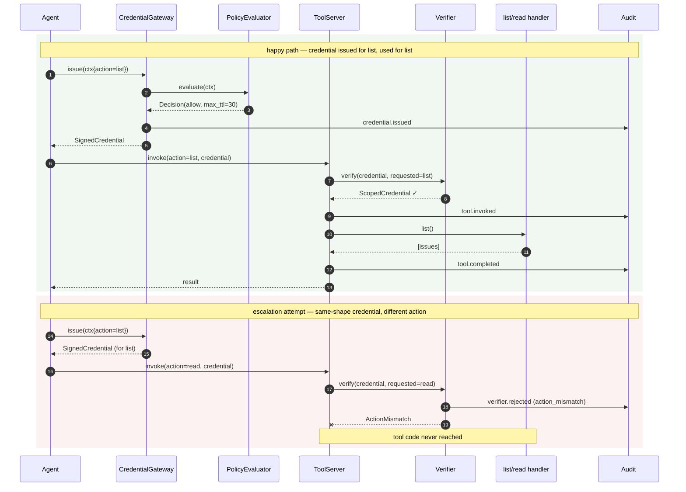

# Agent Identity / MCP Credential Plane — Reference Implementation

[](https://github.com/ryanwilliams90/agent-identity-mcp/actions/workflows/ci.yml)
[](https://github.com/ryanwilliams90/agent-identity-mcp/actions/workflows/codeql.yml)

A small, working demonstration of gateway-mediated scoped credential issuance for agent runtimes calling MCP-style tools.

> **Python 3.11+** · `mypy --strict` clean · `ruff` clean · contract-driven tests · Ed25519 signatures via PyNaCl

This is the **companion code** to the [Agent Identity and MCP Credential Plane](https://github.com/ryanwilliams90/portfolio/blob/main/case-studies/03-agent-identity-mcp-plane.md) case study. The case study argues that agent identity is a different problem from service identity, that the unit of control is *user + agent + task + tool + action + scope* evaluated at execution time, and that scoped execution is the operating model — not a security feature retrofitted later. This repo demonstrates that argument with working code.

It is a reference implementation, not production infrastructure. The boundaries of what it sets out to do are listed under "Non-goals" below.

## The design claim it demonstrates

Three properties make the prototype interesting:

- **Authorization happens at call time, not at install time.** The gateway evaluates a `RequestContext` (user, agent, task, tool, action, audience, environment) on every credential issuance. A buggy or hostile path that asks for a credential it shouldn't get, gets denied — and the denial is in the audit log.
- **Credentials are issued per action and never enter the model context.** Agents receive an opaque scoped credential, not a raw secret. The credential is bound to a specific tool, a specific action, a specific audience, and a short TTL.
- **The verifier is structurally separated from tool code.** The tool server's `invoke` method has no path that reaches a tool handler without calling `Verifier.verify` first. A credential issued for `list` cannot be used to call `read` — the verifier rejects before any tool code runs.

## Threat model the prototype demonstrates

> A buggy or compromised agent/tool path attempts to use a credential issued for one action to perform another action. The verifier rejects before tool execution.

The headline demo:

1. Agent requests a credential to call `issues.list` on behalf of a user. Policy evaluates, gateway signs an Ed25519 credential bound to `(user, agent, task, tool=issues, action=list, audience=tool-server.issues, exp=T+30s, nonce=...)`.
2. Agent presents the credential to the tool server, requests the `list` action. Verifier accepts. List handler runs. Audit shows `credential.issued → tool.invoked → tool.completed`.
3. Agent presents *the credential it received in step 1* (issued for `list`) to call `read`. Verifier rejects with `ActionMismatch` *before* the read handler runs. Audit shows `credential.issued → verifier.rejected` — no `tool.invoked` for the rejected action. The interesting property is that this is a real, valid credential being reused for a different action; the rejection is structural, not a freshness check.

The structural property: the rejection isn't a polite check the tool code chose to make. The verifier is the only path into the handler, so legitimate tool servers don't accidentally bypass scope enforcement.

## The two control-flow paths



Two things the diagram makes visible that prose alone obscures: the verifier sits between the tool server and any tool handler (so a tool server cannot reach a handler without it), and a rejection emits an audit record but no `tool.invoked` event — the handler is structurally never called.

## Audit linkage

Every event in one agent action's chain — issuance, verifier rejection, tool invocation, completion — carries a shared `invocation_id`. A downstream consumer can ask "what happened to invocation X?" and get the full chain back without joining on timestamps. The `invocation_id` is generated at the gateway and signed into the credential, so a verifier-side rejection record carries the same id as the issuance record it correlates to.

## What the verifier checks

Each rejection is a distinct exception class, audited under a distinct outcome code:

| Failure mode | Exception | Audit outcome |
|---|---|---|
| Signature doesn't match the issuer's key | `BadCredential` | `bad_credential` |
| Encoded form is malformed | `BadCredential` | `bad_credential` |
| Audience doesn't match this verifier | `AudienceMismatch` | `audience_mismatch` |
| Action or tool doesn't match the credential | `ActionMismatch` | `action_mismatch` |
| Expiry has passed | `CredentialExpired` | `expired` |
| Nonce already seen by this verifier | `CredentialReplayed` | `replayed` |

The eight test properties from the case study (valid succeeds, wrong action rejected, wrong audience rejected, expired rejected, tampered rejected, replay rejected, denied policy audited, tool code not reached when verification fails) are each pinned by a dedicated test.

## Layout

```
src/aim/
  credential.py    ScopedCredential + Ed25519 sign/verify; encoded wire format
  policy.py        PolicyEvaluator Protocol; HardcodedPolicy reference impl
  gateway.py       CredentialGateway: policy → sign → emit audit
  verifier.py      The structurally-separated verifier; one exception per rejection reason
  tool_server.py   MCP-style server; invoke() calls verifier before any handler runs
  tools/issues.py  The demo tool: list and read on a tiny in-memory store
  audit.py         Structured audit records + InMemoryAuditSink
  py.typed         PEP 561 marker
tests/
  test_credential.py   Sign/verify round-trip; tampering; impostor key; malformed forms
  test_policy.py       Allowed / disallowed / unknown tool / unknown env / obligations
  test_gateway.py      Issuance, denial audit, TTL clamping (defense in depth)
  test_verifier.py     The eight rejection paths, each with its own test
  test_tool_server.py  The escalation-attempt demo; tool code not reached on rejection
  test_end_to_end.py   The full chain; audit shape; denial chain
examples/
  run_flow.py      Runs happy path then escalation attempt; prints the audit chain
```

## Running

```
make install
make all          # lint + type-check + tests
```

Or run the demo:

```
.venv/bin/python examples/run_flow.py
```

Expected output (abbreviated):

```
=== happy path: agent calls list with a list-scoped credential ===
tool returned 3 issues

=== escalation attempt: agent presents the list credential to call read ===
rejected: credential is for issues.list, request is for issues.read

=== audit chain ===
(invocation_id ties events from one agent action together)

--- happy path ---
{"kind": "credential.issued", "invocation_id": "7d3603a5...", "outcome": "issued"}
{"kind": "tool.invoked",      "invocation_id": "7d3603a5...", "outcome": "invoked"}
{"kind": "tool.completed",    "invocation_id": "7d3603a5...", "outcome": "ok"}

--- escalation attempt ---
{"kind": "credential.issued", "invocation_id": "3631c5fc...", "outcome": "issued"}
{"kind": "verifier.rejected", "invocation_id": "3631c5fc...", "outcome": "action_mismatch"}
```

## What this is not

- **A production auth system.** Real deployments need credential revocation, key rotation, replay state that survives a process restart, and an audit sink that's durable and tamper-evident. None of those are here.
- **A canonical reference framework.** The prototype demonstrates a design claim. It is not trying to be the implementation that organizations adopt.
- **A full MCP implementation.** The tool server is MCP-style — invoke an action with arguments, return a result — but doesn't implement the MCP protocol itself.
- **A policy engine.** `HardcodedPolicy` exists to satisfy the `PolicyEvaluator` Protocol so the rest of the system is exercisable end to end. Real deployments would back the evaluator with OPA, Cedar, or similar.
- **A revocation service.** A real platform needs a way to revoke a credential before its TTL expires. The verifier here only checks signature, audience, action, expiry, and replay; there is no revocation list. Adding one is a small change against this design (the verifier consults a revocation set before accepting), but it isn't here.
- **Delegation chains.** A credential carries a single user and a single agent. Multi-step task graphs and delegated authority are out of scope here; the case study's "open questions" section discusses what those would require.
- **Handle-isolation between agent and credential bytes.** The case study mentions that production designs may give the agent an opaque handle that the gateway resolves on its behalf, keeping the raw credential out of the agent runtime. The prototype does not do this — the agent receives the encoded credential string directly. The prototype's claim is *scope-binding* (the credential is cryptographically restricted to one action), not *handle-isolation* (the agent never holds the credential). Both are useful properties; this prototype demonstrates the first, not the second.

## Notes on choices

- **Ed25519, not HMAC.** The case study is about agent *identity*. A core property of identity systems is that verifiers can check credentials without sharing secrets with the issuer. HMAC requires the tool server and the gateway to share a key — exactly the shape an agent-identity story should reject. Ed25519 lets the gateway sign with a private key and any tool server verify with a public key, which is what production systems actually do (RS256/ES256 JWTs, SPIFFE's X.509, etc.).
- **Policy as a Protocol with a hardcoded implementation.** The Protocol shape (`evaluate(ctx) → Decision` with `allow` / `reason` / `obligations`) maps cleanly to OPA's decision documents and Cedar's policy outcomes. Swapping `HardcodedPolicy` for a real backend is substituting an implementation, not rewriting call sites.
- **Defense-in-depth on TTL.** The gateway clamps issued TTL to `min(ceiling, max_ttl_obligation)`. Even a buggy policy that asks for a 600-second TTL gets clipped to the gateway's 60-second ceiling. The audit record carries the actual issued expiry; what the policy *asked* for and what the gateway *granted* are not assumed equal.
- **Wire format: base64url(JSON) + "." + base64url(signature).** Resembles a JWT visually but is *not* JWT-compatible — there is no header segment, the algorithm is implicit (Ed25519), and the payload schema is the `ScopedCredential` dataclass, not the JWT claim set. JSON was the cheapest readable choice for a prototype; production designs would more plausibly use CBOR or COSE for compactness and signed-payload determinism, with proper header negotiation for algorithm agility.
- **In-memory replay cache, per verifier instance.** This is the prototype's most material production weakness, called out explicitly: each `Verifier` instance maintains its own nonce set, so a fleet of N verifiers cannot detect cross-instance replay — an attacker who captures a credential and presents it to a different verifier than the one that originally accepted it will pass the replay check. Real deployments need a shared, atomic check-and-set against a store like Redis (with TTL eviction tied to credential expiry). The prototype demonstrates the *property* of replay rejection, not the deployment shape.
- **Audit sink in-memory.** `InMemoryAuditSink` is sufficient to demonstrate that every event in the trust chain is captured. A real platform writes to a durable, append-only sink with cryptographic chaining (Merkle tree or hash-chained) for tamper-evidence and forwards to a SIEM. The `AuditSink` Protocol exists so swapping the backend doesn't touch the gateway, verifier, or tool server.

## Related

- Portfolio: [`ryanwilliams90/portfolio`](https://github.com/ryanwilliams90/portfolio)
- Case study: [Agent Identity and MCP Credential Plane](https://github.com/ryanwilliams90/portfolio/blob/main/case-studies/03-agent-identity-mcp-plane.md)
- Companion gateway prototype: [`orchestration-gateway-pattern`](https://github.com/ryanwilliams90/orchestration-gateway-pattern)
